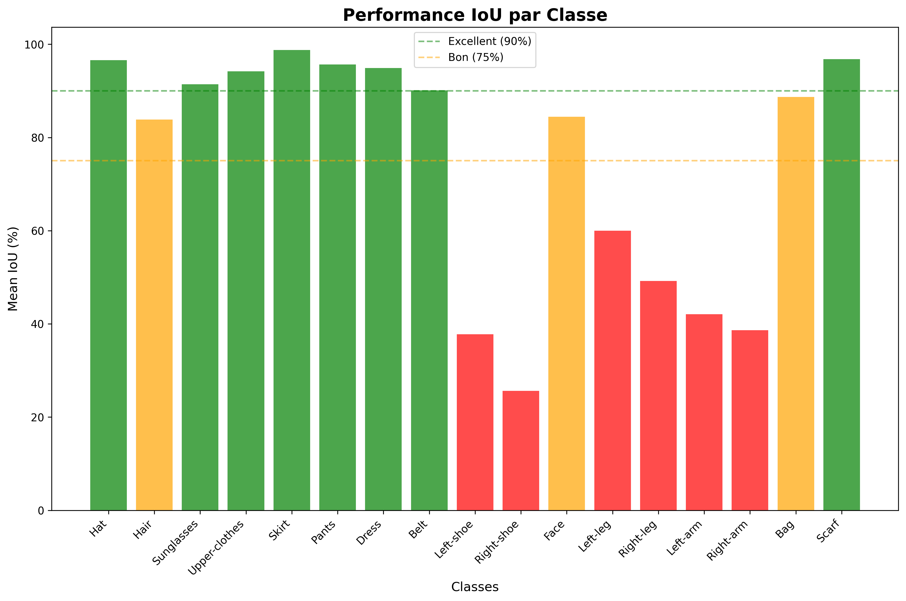
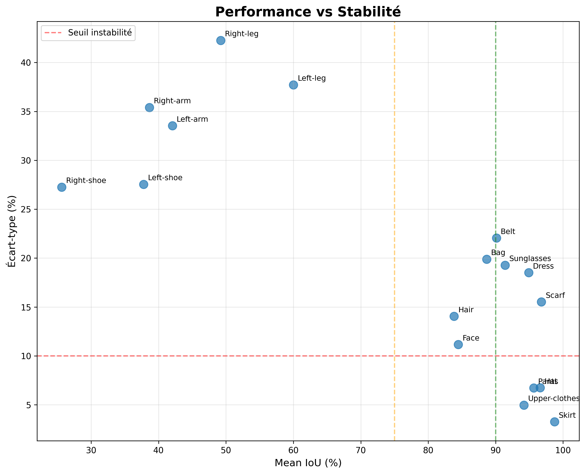
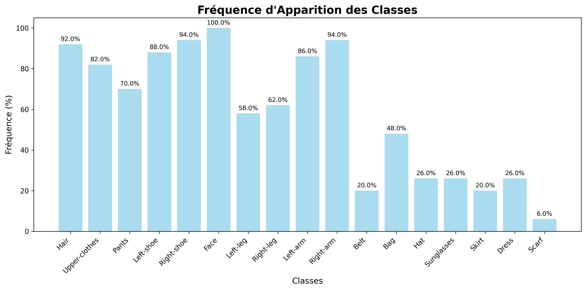
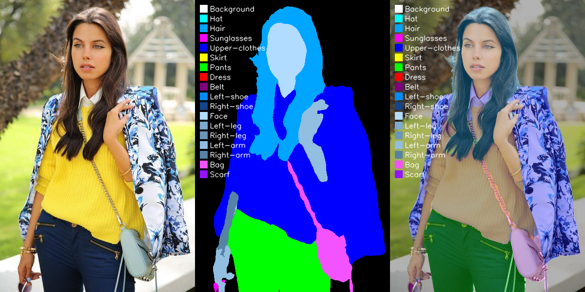
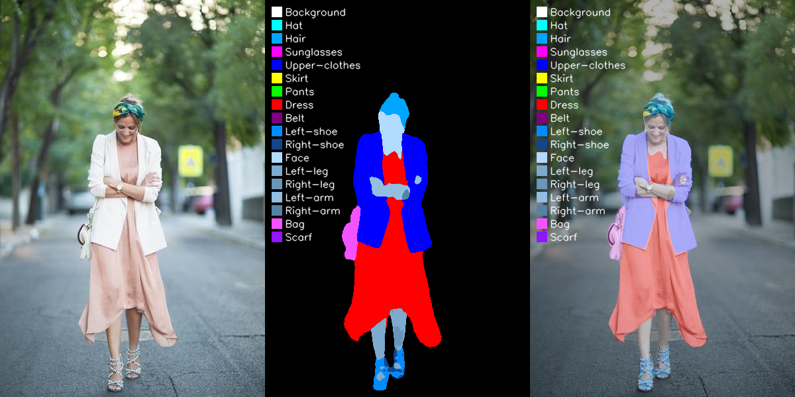

# 📊 Rapport d'Évaluation du Modèle de Segmentation

## Vue d'ensemble
- **Nombre d'images évaluées** : 50
- **Mean IoU global** : 74.9%
- **Précision des pixels** : 85.5%
- **Stabilité (écart-type)** : ±8.4%

## 🎯 Performance par classe

### Classes excellentes (IoU ≥ 90%)
| Classe | Mean IoU | Écart-type | Stabilité |
|--------|----------|------------|----------|
| Hat | 96.6% | ±6.7% | 🟢 Stable |
| Sunglasses | 91.4% | ±19.3% | 🟡 Variable |
| Upper-clothes | 94.2% | ±5.0% | 🟢 Stable |
| Skirt | 98.7% | ±3.3% | 🟢 Stable |
| Pants | 95.7% | ±6.7% | 🟢 Stable |
| Dress | 94.9% | ±18.5% | 🟡 Variable |
| Belt | 90.1% | ±22.1% | 🔴 Instable |
| Scarf | 96.8% | ±15.5% | 🟡 Variable |

### Classes bonnes (IoU 75-90%)
| Classe | Mean IoU | Écart-type | Stabilité |
|--------|----------|------------|----------|
| Hair | 83.8% | ±14.0% | 🟡 Variable |
| Face | 84.5% | ±11.2% | 🟡 Variable |
| Bag | 88.7% | ±19.9% | 🟡 Variable |

### Classes problématiques (IoU < 75%)
| Classe | Mean IoU | Écart-type | Stabilité |
|--------|----------|------------|----------|
| Left-shoe | 37.8% | ±27.5% | 🔴 Instable |
| Right-shoe | 25.6% | ±27.3% | 🔴 Instable |
| Left-leg | 60.0% | ±37.7% | 🔴 Instable |
| Right-leg | 49.2% | ±42.3% | 🔴 Instable |
| Left-arm | 42.0% | ±33.5% | 🔴 Instable |
| Right-arm | 38.7% | ±35.4% | 🔴 Instable |

## 📈 Analyse de stabilité

Le modèle présente une stabilité 🟡 **Modérément stable** avec un écart-type de ±8.4%.

**Interprétation** : Les performances varient en moyenne de ±8.4% entre les images.

## 📊 Fréquence d'apparition des classes

## ⚠️ Classes à surveiller
- ⚠️ **Left-shoe** : 66% d'échecs - Amélioration recommandée
- 🚨 **Right-shoe** : 86% d'échecs - Révision urgente
- 💡 **Left-arm** : 58% d'échecs - Surveillance
- 💡 **Right-arm** : 56% d'échecs - Surveillance

## 🏆 Top/Flop images

### Meilleures performances
| Image | Mean IoU | Performance |
|-------|----------|-------------|
| mask_37.png | 85.9% | 🟢 Bonne |
| mask_5.png | 86.0% | 🟢 Bonne |
| mask_45.png | 87.9% | 🟢 Bonne |
| mask_43.png | 88.0% | 🟢 Bonne |
| mask_21.png | 93.0% | 🟢 Bonne |

#### Exemple de meilleure segmentation
**Best segmentation (Image 21)**

### Performances à améliorer
| Image | Mean IoU | Performance |
|-------|----------|-------------|
| mask_26.png | 57.6% | 🔴 Faible |
| mask_39.png | 58.8% | 🔴 Faible |
| mask_6.png | 62.1% | 🟡 Moyenne |
| mask_25.png | 62.8% | 🟡 Moyenne |
| mask_22.png | 62.9% | 🟡 Moyenne |

#### Exemple de segmentation problématique
**Problematic segmentation (Image 26)**

### 📊 Analyse Pixel Accuracy

🟢 **Bonne** performance : 85.4%

### 🎯 Analyse Mean IoU

**Mean IoU global** : 57.6%

*💡 Rappel* : IoU faible + Petite classe = Problème de détection | IoU faible + Grande classe = Problème de segmentation

**Détail par classe** :
- 🟢 **Hat** : 100.0% (Bonne)
- 🔴 **Hair** : 22.8% (Faible)
- 🟢 **Sunglasses** : 100.0% (Bonne)
- 🟢 **Upper-clothes** : 90.8% (Bonne)
- 🟢 **Skirt** : 100.0% (Bonne)
- 🟢 **Pants** : 100.0% (Bonne)
- 🟢 **Dress** : 93.2% (Bonne)
- 🟢 **Belt** : 100.0% (Bonne)
- 🔴 **Left-shoe** : 29.0% (Faible)
- 🔴 **Right-shoe** : 5.4% (Faible)
- 🟢 **Face** : 77.8% (Bonne)
- 🔴 **Left-leg** : 29.0% (Faible)
- 🔴 **Right-leg** : 0.4% (Faible)
- 🔴 **Left-arm** : 45.5% (Faible)
- 🔴 **Right-arm** : 0.0% (Faible)
- 🟢 **Bag** : 85.0% (Bonne)
- 🔴 **Scarf** : 0.0% (Faible)

### 🔍 Analyse Distribution vs Performance

- 🚨 **Hair** : Classe rare (0.1% GT) avec IoU faible (22.8%) → Problème de détection
  - Détection en prédiction : 0.5%
- 🚨 **Left-shoe** : Classe rare (0.3% GT) avec IoU faible (29.0%) → Problème de détection
  - Détection en prédiction : 0.5%
- 🚨 **Right-shoe** : Classe rare (0.3% GT) avec IoU faible (5.4%) → Problème de détection
  - Détection en prédiction : 0.1%
- 🚨 **Left-leg** : Classe rare (0.4% GT) avec IoU faible (29.0%) → Problème de détection
  - Détection en prédiction : 0.8%
- 🚨 **Right-leg** : Classe rare (0.4% GT) avec IoU faible (0.4%) → Problème de détection
  - Détection en prédiction : 0.2%
- 🚨 **Left-arm** : Classe rare (0.4% GT) avec IoU faible (45.5%) → Problème de détection
  - Détection en prédiction : 0.5%
- 🚨 **Right-arm** : Classe rare (0.2% GT) avec IoU faible (0.0%) → Problème de détection
  - Détection en prédiction : 0.1%
- 🚨 **Scarf** : Classe rare (0.2% GT) avec IoU faible (0.0%) → Problème de détection
  - Détection en prédiction : 0.0%

### 📈 Répartition des Performances

- 🏆 **Excellentes** (≥90%) : 7/17 classes
- 🟢 **Bonnes** (75-90%) : 2/17 classes
- 🟡 **Modérées** (50-75%) : 0/17 classes
- 🔴 **Faibles** (<50%) : 8/17 classes

